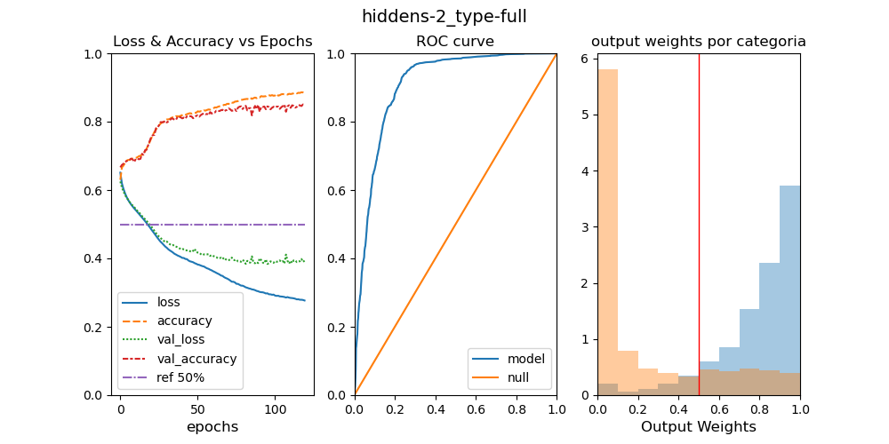
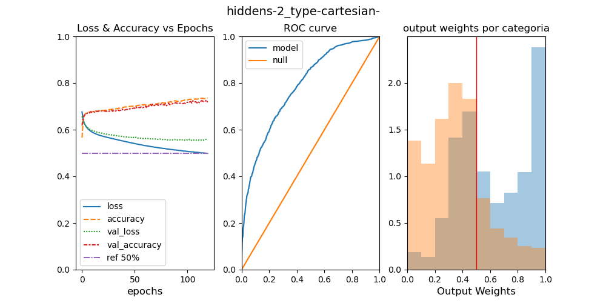
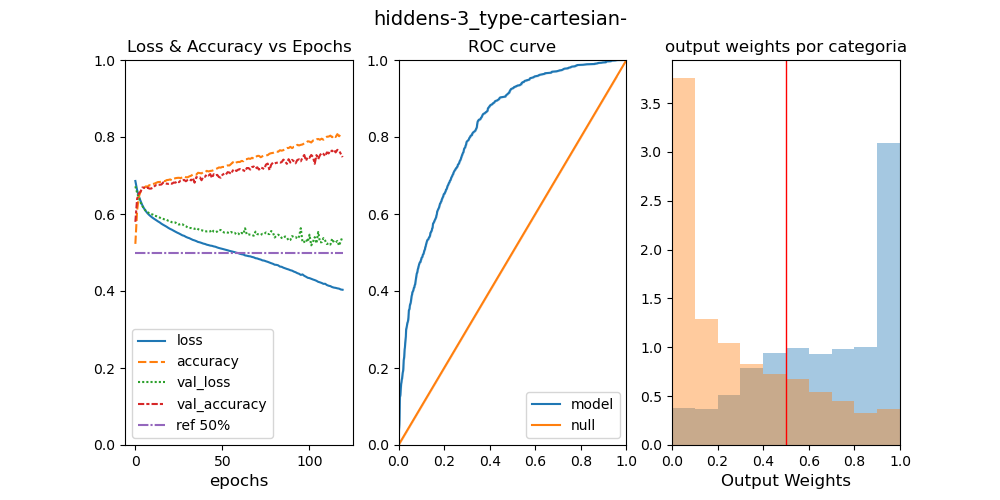

# AIFriendly-LHC
AI-Friendly learns to detect Higgs' Boson in a dataset with simulations from the Large Hadron Collider 

---

<h2>
<b>1) What are the features in a Large Hadron Collider database?</b>
</h2>
 
<i>The format this work refers to is the <a href="http://madgraph.phys.ucl.ac.be/Manual/lhco.html">LHCO</a> format. It has three types of features: kinematic, particle numbers (e.g. leptonic number) and others (dummy features and event index). In the present work we will refer to the presence or absence of the particle numbers by refering to the 'full' database VS the 'kinematic' database.</i>

---

<h2>
<b>2) What is AI-Friendly's performance over the database?</b>
</h2>
 
<i>When trained over the full database (i.e. the database with both kinematic info and particle numbers info) AI-Friendly obtained a classification accuracy of more than 80% which led to a model with an area under the reciever operating curve (ROC) of more than 90% (see graph below).</i>

 
<b>Full Database</b>. LEFT: training metrics (loss and accuracy) for the training and validation set; MIDDLE: ROC-curve over the testing set; RIGHT: output weights per category over the testing set.

---

<h2>
<b>3) How important is the kinematic information?</b>
</h2>
 
<i>AI-Friendly was trained over the kinematic database (i.e. the database with only kinematic features) and the performance was approximately the same. The conclusion is that kinematic information has a high relative importance</i>

 
<b>Only Kinematic Information</b>. LEFT: training metrics (loss and accuracy) for the training and validation set; MIDDLE: ROC-curve over the testing set; RIGHT: output weights per category over the testing set. <b>Compare against the previous chart and note that the AUC and accuracy is almost the same</b>

---

<h2>
<b>4) How important is the coordinate system in which the kinematic information is expressed in?</b>
</h2>
 
<i>AI-Friendly was trained over the kinematic database rewritten in cartesian coordinates and the predictive quality was relatively poorer than the one obtained from training AI-Friendly with the spherical coordinate system</i>

 
<b>Only Kinematic Information in cartesian coordinates</b>. LEFT: training metrics (loss and accuracy) for the training and validation set; MIDDLE: ROC-curve over the testing set; RIGHT: output weights per category over the testing set. <b>Compare against the previous chart and note that the AUC and accuracy is now worst</b>

---

<h2>
<b>5) Does adding more layers increase AI-Friendly's accuracy when the coordinate system is cartesian? Why?</b>
</h2>
 
<i>Allowing AI-Friendly to perform 'Deep Learning' (i.e. adding two layers) led to better results for the kinematic database in cartesian coordinates and the interpretation is that, as more depth allows for a greater complexity, it is now possible for AI-Friendly to internally map the cartesian vectors into a somewhat more convenient system.</i>

 
<b>Only Kinematic Information in cartesian coordinates with Deep Learning</b>. LEFT: training metrics (loss and accuracy) for the training and validation set; MIDDLE: ROC-curve over the testing set; RIGHT: output weights per category over the testing set. <b>Compare against the previous chart and note that the AUC and accuracy is now better</b>. The database wasn't big enough to allow the adding of even more layers.

