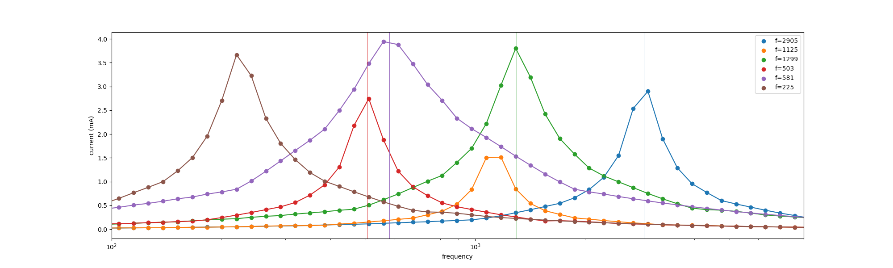
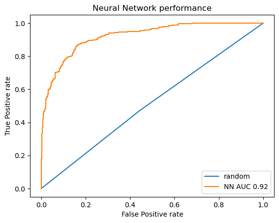
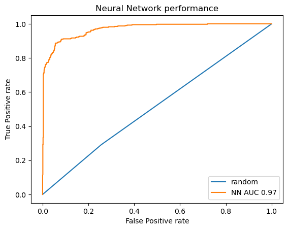
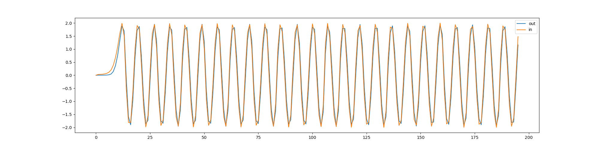
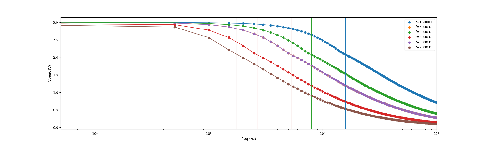
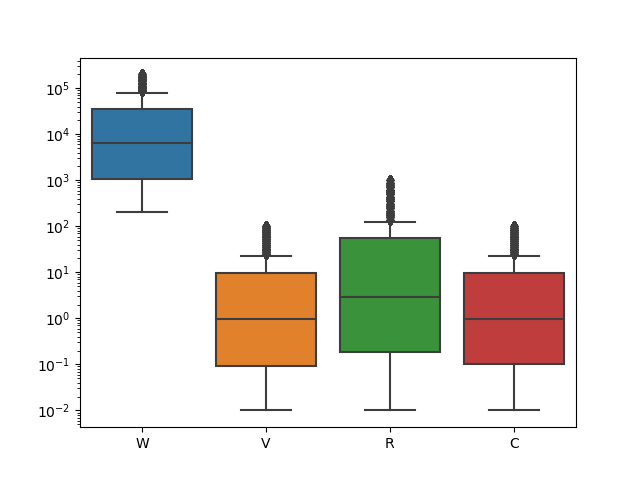
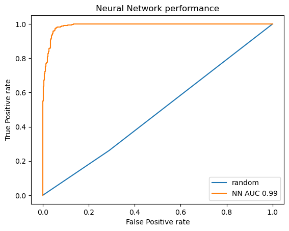
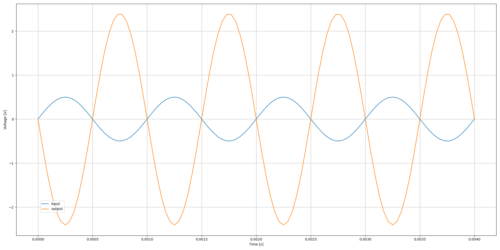
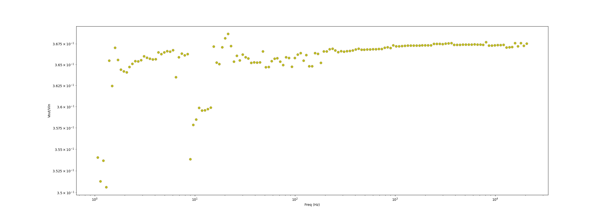

# AIFriendly-circuits

In the present script AI-Friendly learns how to detect if adding a diode will result in it being burnt for different circuits

---

<b>CIRCUIT 1: RLC-series circuit</b> 

<b> This is the circuit 
This are the currents over each passive component  
This are some resonance curves: current over resistance vs freq 
This are the parameters used to generate the database 
This is the ROC of AI-Friendly over the database 
We conclude it has learnt very well</b>

---

<b>CIRCUIT 2: Sallen-Key low-pass-filter</b> 

<b> This is the circuit 
This are the input and output voltage  
This are some transmission curves: output voltage over resistance vs freq 
This are the parameters used to generate the database 
This is the ROC of AI-Friendly over the database 
We conclude it has learnt very well</b>

---

<b>CIRCUIT 2: RC-series low-pass-filter</b> 

<b> This is the circuit 
This are the input and output voltage  
This are some transmission curves: output voltage over resistance vs freq 
This are the parameters used to generate the database 
This is the ROC of AI-Friendly over the database 
We conclude it has learnt very well</b>

---

<b>CIRCUIT 2: Amplifier</b> 

<b> This is the circuit 
This are the input and output voltage  
This are some amplification vs frequency curves: under the current architecture not any group of parameters lead to a viable amplifier; sometimes the output voltage is lower than the input voltage and in general the coefficient depends on the frequency. 
This are the parameters used to generate the database 
This is the ROC of AI-Friendly over the database 
We conclude it has learnt very well</b>

