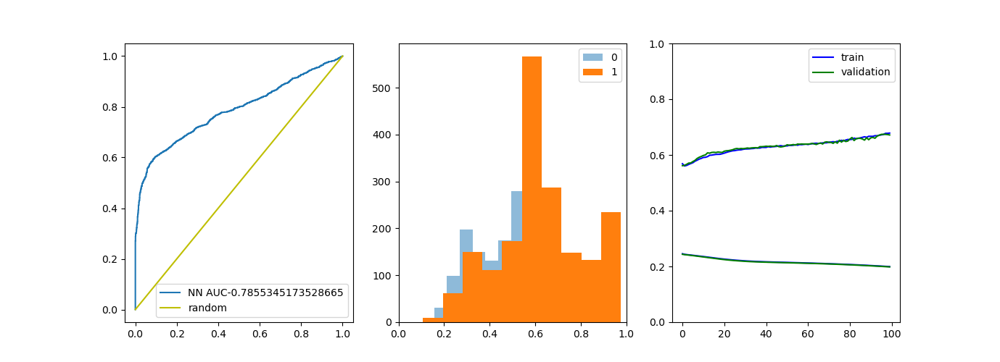

# AIFriendly-complex-dynamics
AI-Friendly detects phase-space points that are forbidden at t=inf
<br><br>
<i><b>The theoretical background is as follows:</b> given a nonlinear homogeneous ODE in two dimensions, the existence of repulsors can be confirmed by looking for stationary points which have an infinitesimal evolution operator with an outward-pointing gradient. 
<br>
i.e. the linealized equation on the fixed points has only strictly-positive eigenvalues. 

<br>

---

<h2><p align="center"><b>Generating the database</b></p></h2>
<br>
<b>DISCLAIMER: This section is optional as the database is provided in the repository!</b>
<br>


To generate the database you (1) generate such equations, (2) calculate the eigenvalues of the linearized equations around the fixed points (it takes aproximately 1 second per equation) and (3) append the equation to the database with the correct tag. </i>
<br><br>
To generate the database yourself run: 
<br>

```bash
bash generate_database.sh
```
<br>
or else run "scripts/for_colab.ipynb" in GoogleColab. This is recommended due to the CPU-intensity of the script.<br>

---

<h2><p align="center"><b>Fitting a two-layer neural network</b></p></h2>
<br>
To fit a two-layer neural network and save the results to "static/curve.png" please run

```bash
bash generate_network.sh
```

<br>
<b>The result is as follows</b>
<br>



<h2><p align="center"><b>Conclusions</b></p></h2>
<br>
<i>As the size of the database increases, an upward trend in the accuracy was observed. In the near future, the repository will be upgraded with a bigger database that almost certainly will lead to a model with arbitrary good accuracy</i>
