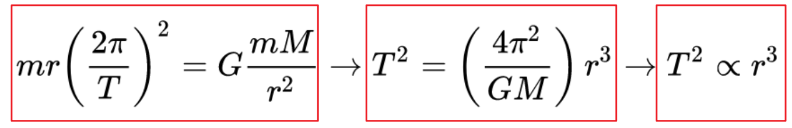
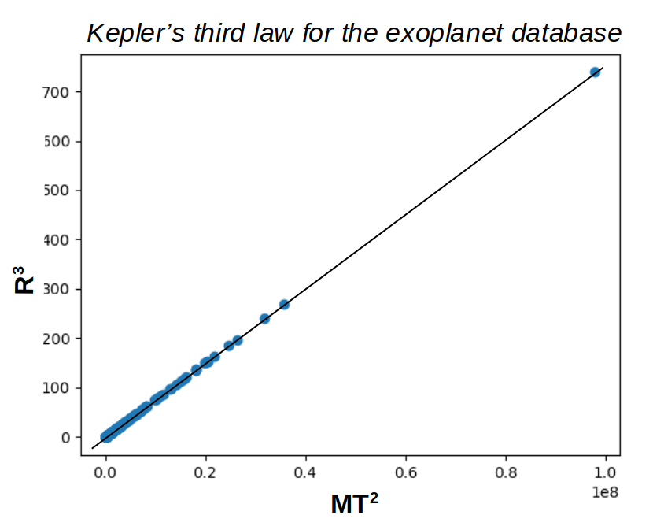
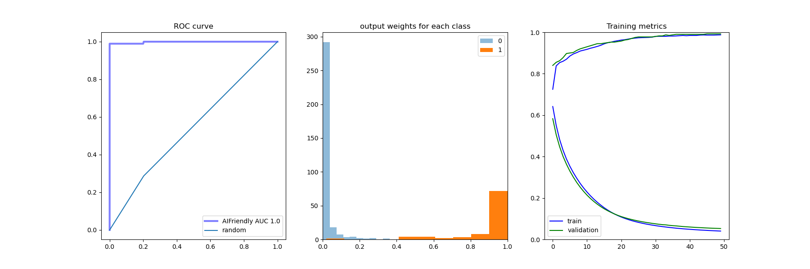
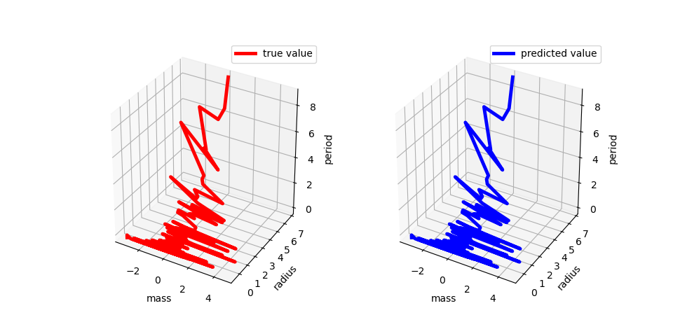
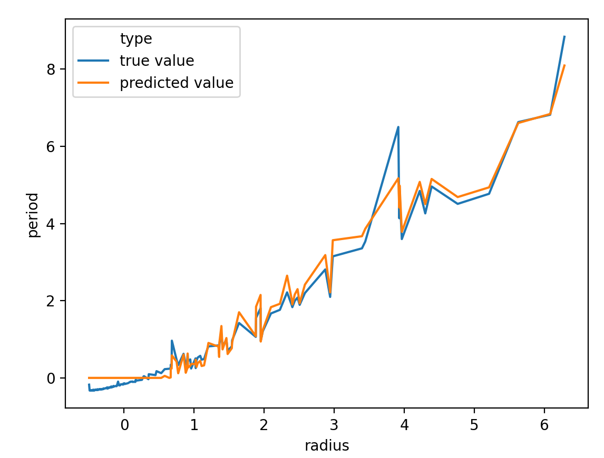

# AIFriendly-exoplanets
:ringed_planet:AIFriendly can tell if an orbital period is so big that it can not be observed in a lifetime based on the orbital radio and the mass of the associated star

```bash
bash run-all.sh
```

<sub><i>(running the following will run all the scripts at once; i.e. the ones in points [3] and [4] in the current text)</i></sub>

---

<h2><p align="center">1) Intro - a problem solved by Kepler in the year 1620 </p></h2>
<b>Kepler's third law quantifies a mass-dependent proportionality between the orbital radius and the orbital period</b><br>
<i>(left)</i>Newton's equation for the gravitational pull and the radial acceleration, <i>(middle)</i> rearrangement of the factors and <i>(right)</i> Kepler's law.

<br>
<i>The law can be qualitatively put to test by plotting the cube of the radius vs the mass times the square of the period. The conclusion is that all points lie on a line.</i>
<p align="center"></p>
<br>
<sub><i>Actually the 'radius' is the semi-major axis given that the model is based on ellipses rather than in circles</i></sub>
<br>

---

<h2><p align="center">2) A database with values for mass, orbital period and orbital radius for a few thousand exoplanets</p></h2>
[The Exoplanets Database](http://exoplanets.org/) provides ~400 parameters for ~5k exoplanets. The three parameters we are interested in (radius, period and mass) are present in the list of parameters.<br>
<sub><i>A reduced version was used by filtering based on keeping only planets that weren't vettoed by the organization, thus the remaining dataset was then of 2.5k planets.</i></sub>
<br>

---

<h2><p align="center">3) AIFriendly recognizes systems with orbital periods that exceed a human lifetime</p></h2>
<br>
<b>Running the following script will train AIFriendly over the exoplanet database and the results will be saved at "gallery/results.png". The conclusion is that AIFriendly is an excellent detector of planets with an orbital period that exceeds a human lifetime.</b> 
<br>

```bash
bash generate_classification.sh
```

<br>
<br>
<i>Classification results: (left) ROC-curve, (middle) output weights per category and (right) training metrics.</i>

---

<h2><p align="center">4) A more difficult problem: regression and the power of Neural Networks</p></h2>
<br>
<b>The classification task defined by setting a threshold for the period is a particular case of the regression problem: predicting a value for the orbital period based on the planet's radius and the star's mass. Running the following scripts will show how changing AIFriendly's last activation function for a linear one, thus allowing it to do regression, leads to excellent results (stored in "gallery/regression-testing-predictions.png")</b>
<br>

```bash
bash generate_regression.sh
bash generate_gallery.sh
```

<p align="center">

<br>
<b>view the regression in 3-D</b>
<br>

<br>
<b>view the regression in 2-D</b>
</p>

---


<b>About the dataset</b><br>
<i>1.8k planets were used for training<br>
0.4k planets were used for validation<br>
0.4k planets were used for testing<br></i>
