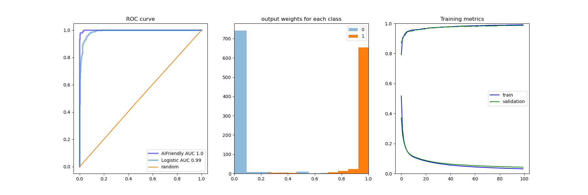

# AIFriendly-group-theory
AI-Friendly recognizes the number of distinct irreductible representation of the product of two Lie groups

<br>
To generate the database and fit a neural network that generates the results, please run:

```bash
bash generator.sh
```

<br>

<br><i>Based on <a href="https://arxiv.org/abs/2011.00871">this</a> paper</i><br>

<h2><p align="center><b>The Database</b></p></h2>
Based on a raw database that has 

* <b>X:</b> Pairs of (padded) weight vectors that generate either SU(2), SU(3), SU(4) or SU(5)
* <b>Y:</b> The number of irreductible representations of the group that results from the tensor product of the respective pair

A simple regular expression is applied and finally a "database.csv" file is geenrated. 
To define a classification task, the default threshold for binary recognition was set as "Y>9", i.e. "more than 9 irreductible representations" 

<h2><p align="center><b>The neural network</b></p></h2>

AI-Friendly performed with accuracy 100%, thus being able to "squeeze" the information that a simple logistic regression wasn't able to extract, see figure below


<sub>
<i><b>LEFT:</b> ROC-Curve of the random hypothesis (yellow, AUC=50%), a logistic regression (light-blue,AUC=99%) and AI-friendly (dark-blue, AUC=100%).
<br>
<b>MIDDLE:</b> Output weights per category for the neural network (i.e. AI-Friendly)
<br>
<b>RIGHT:</b> Training metrics for the neural network (i.e. AI-Friendly); concluding that there was no overfitting can be supported by the observed relatively small training-validation gap</i>
</sub>
