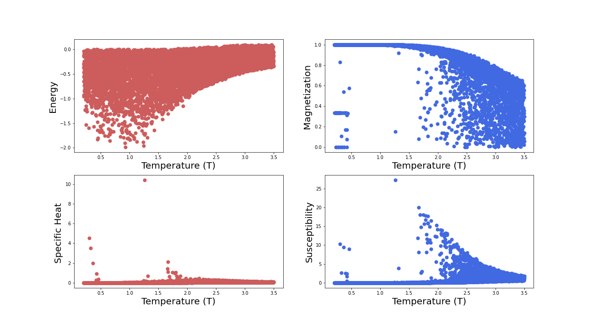
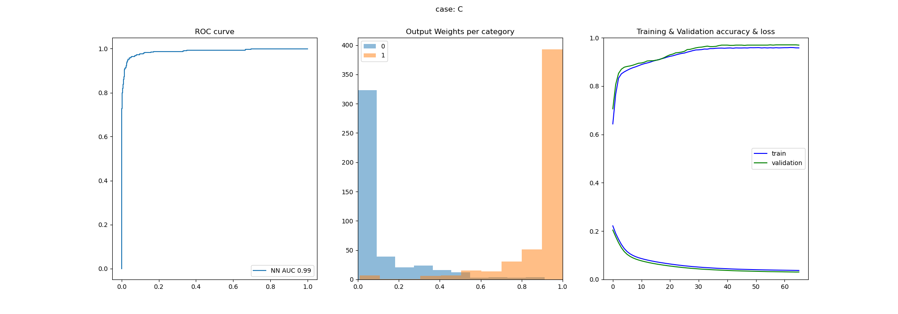
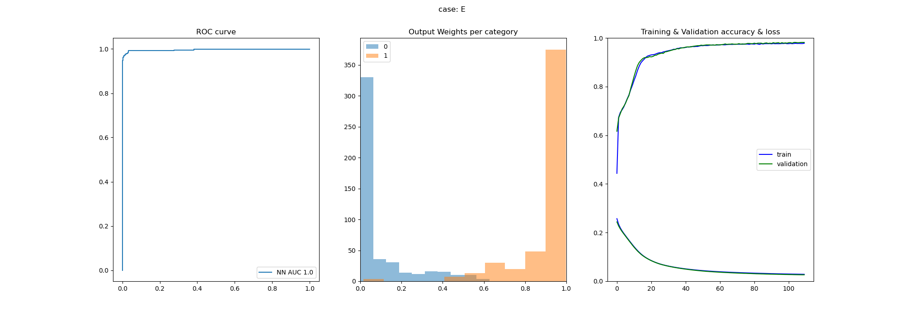
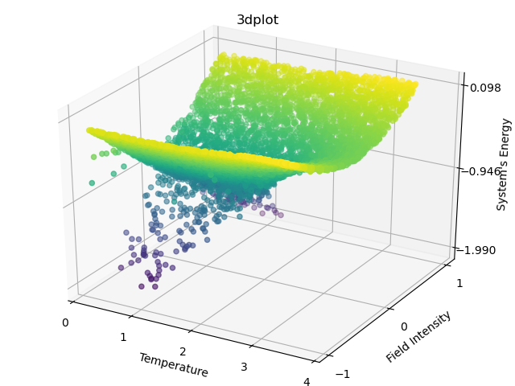

# AIFriendly-ising
AI-Friendly learns the system's equilibrium magnetization for the general problem<br>


---

<h2><br><p align="center">1) Generating a database</p></b></h2>

<b> Simulations of the 2d Ising problem with a constant field or arbitrary intensity can be generated by running in the console:</b>
  
```bash
bash generate_dataset.sh
```
<br>
<sub><i>(as it is very CPU-intensive and the final size is smaller than 1Mb it is here provided. An alternative for generating it is running in Google Colab the script called "for_colab.ipynb")</i></sub>
<br>
<br>
<b>A subproduct of generating the database is generating a graph that presents the four variables of interest as a function of temperature: Energy (E), Magnetization (M), Specific Heat (C) and Susceptibility (X) in western natural reading order respect.</b>

<br>
<sub><i>(other 2D and 3D plots are also generated for taking into account the effect of the magnetic field applied to the system)</i></sub>


---

<h2><br><p align="center">2) Stating the classification problem</p></b></h2>

<br>
<b>The classification task will be to recognize if the variables of interest exceed a certain threshold. It can be manually set by passing a float between 0 and 1 when training e.g.</b><br>
<br>
<b>If no argument is passed it defaults to 50%.</b><br>

```bash
bash generate_networkfit.sh 0.75
```


<br>
<sub><i>(the threshold for magnetization is applied to the absolute value; e.g. abs(M)> 50% max(M))</i></sub>
<br>

---

<h2><br><p align="center">3) Results for threshold at 50%</p></b></h2>
<br>
<b>Results will be stored at the gallery</b>, e.g. for the Heat Capacity over the testing set: (left) ROC-curve, (middle) output weights and (right) training metrics.
<br>

<br> 
<i>Another example: AIFriendly is able to detect if the Energy will be higher than the median of the dataset from the field intensity and the temperature</i>
<br>

<br>
<sub><i><b>Classification results for the Energy</b></i></sub>
<br>

<br>
<sub><i><b>A view of the geometry that is being parametrized: the Energy is the only variable that is not linearly separable</b></i></sub>
