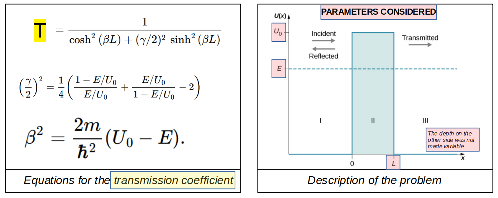
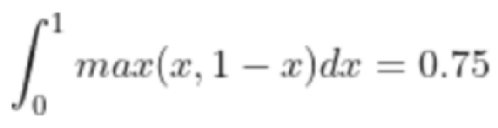
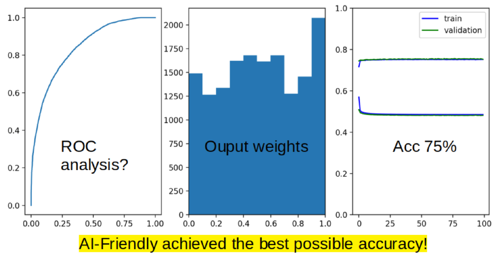

# AIFriendly-quantum-tunneling
AIFriendly was able to predict the transition probability based on the three physical parameters: Potential shape (height & width) and incident Energy level<br>
<i>(The database is here provided because it's CPU-intensive; you can also build it yourself running ```bash generate_database.sh```)</i>

---

<h2><p align=center><b>1) Introduction</b></p></h2>
<br>
<i>This are the equations (left) and the diagram (right) that describe the Quantum Mechanical problem of a particle that is related to a potential barrier. There are three parameters: the incident Energy, the barrier's height and the barrier's thickness.</i><br>

---

<h2><p align=center><b>2) How should we test AI-Friendly against this problem?</b></p></h2>

<i><b>WRONG :-1: : regression/classification:</b> The transition coefficient is a number as a function of the system's parameters (i.e. energy, height of the wall and width of the wall). Treating it as a regression problem, the conclusion is that AI-Friendly can fit it perfectly; that shouldn't be a surprise in the context of Feed Forward Neural Networks having so many degrees of freedom.
<br>

<b>RIGHT :+1: pattern-recognition:</b> The conclusion is that the problem will be treated as pattern recognition: mixed tags will occur at the same time; database will contain examples of a particle both having tunneled and not-tunneled with probability equal to "transition-coefficient" according to a Bernoulli process</b></i>
<br> 

<h2><p align=center><b>3) What is the highest achievable accuracy for a collection of systems uniformly distributed in transition probabilities?</b></p></h2>

<i><b>WRONG :-1: : 100%:</b> mapping Bernoulli trials to the domain will lead to cases in which one same vector has two associated outcomes; hence it will be impossible to obtain maximum accuracy when dealing with Bernoulli-probabilities different from 0% (no-tunneling) or 100% (only tunneling, no 'bouncing').
<br>

<b>RIGHT :+1: 75%:</b> for the case in which all Bernoulli-probabilities appear in equal relative proportions (i.e. the distribution of the Bernoulli-probability is a random distribution) the best accuracy a deterministic predictive-model can achieve is 75%, as shown in the following image:</b></i>
<br> 


<h2><p align=center><b>4) How did AI-Friendly perform at taggin the input vectors of a database of different physical parameters (Energy, Height and Width)? </b></p></h2>
<i><b>As good as it can be done :+1: 75%</b> <br>
The ROC-curve (left), output weights (middle) and training & validation curves for accuracy and loss are shown next.
<br></i>

<i>you can generate this results yourself by running</i> 

```
bash generate_network.sh
```

