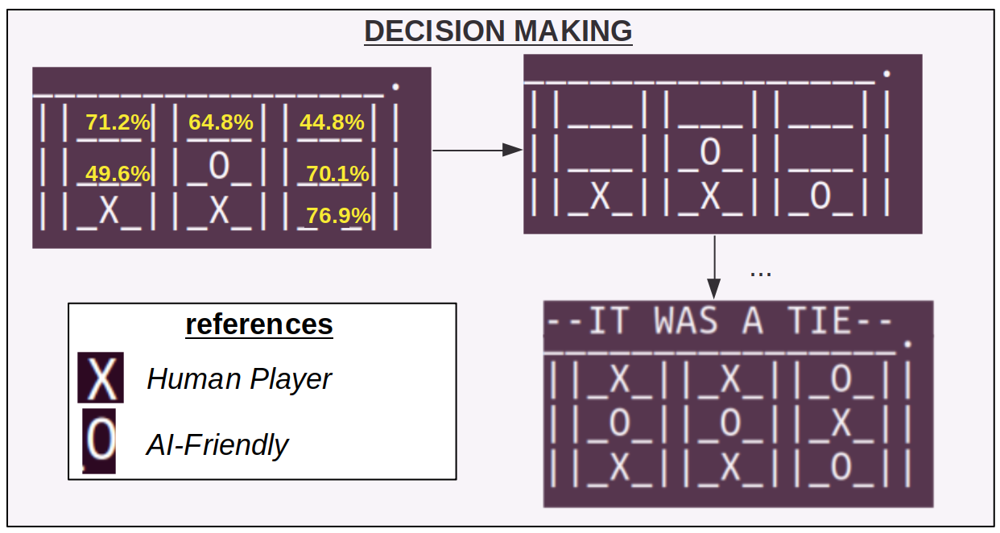

# AIFriendly-ticktacktoe


<h3>AI-Friendly plays tic-tac-toe</h3>


---

<h2> In a Nutshell </h2>


---

<h1><p align="center"><b>STEP 1: BUILD</b></p></h1>

```bash
bash build.sh
```

To build the models yourself please run
<sub>
* Building takes 5 minutes
* 2 information graphs are shown and script resumes after manually closing them
* Uses python3 and specifically Keras (<a href="https://pypi.org/project/Keras/">pip install keras</a>)
* Ends with a direct match between you and AIFriendly
</sub>

---

<h1><p align="center"><b>STEP 2: PLAY</b></p></h1>


To play against AI-Friendly after building run

```bash
bash play-first.sh
```
If you want to be the "X", or 

```bash
bash play-second.sh
```

If you want to be the "O"
<br>
Finally: if you want to make it more intelligent then run
```bash
bash enhace.sh
```
<sub>(it can be enhaced as many times as you want, suggested: start with one)</sub>

If you want to play against the 'enhaced AI' then you must add the flag 'enhace' to the playing scripts
e.g.

```bash
bash play-second.sh enhace
```

---

<h1>More Info:</h1>

<h2>1) How did AI-Friendly learned to play Tic-Tac-Toe?</h2>
<i>AI-Friendly was able to learn how to play Tic-Tac-Toe by finding patterns in a tic-tac-toe database.</i>

<h2>2) Does this problem differs from other problems that AI-Friendly solved?</h2>
<i>Yes, the present task stands out in the context of it being what is called 'pattern recognition'</i>

<h2>3) What are the main differences between pattern-recognition tasks and pure-classification tasks?</h2>
<i>In pure-classification tasks the objects tend to be uniquely defined: a chair is 100% a chair and a cat is 100% a cat; wether in this problem which involves pattern-recognition one same move in the training database may be sometimes tagged as "a good move" and other times as "a bad move".</i>

<h2>4) How was the database generated?</h2>
<i>A training database was generated by defining a class with an attribute that makes a random move, instantiating two of such objects and finally making them both play against each other. The result was a collection of ~ 10k tic-tac-toe games</i>

<h2>5) Training with the randomly-generated database leads to an insatisfactory amount of intelligence. What can I do?</h2>
<i>You can re-train it against itself and thus make it smarter by running</i>

```bash
bash enhace.sh
```

